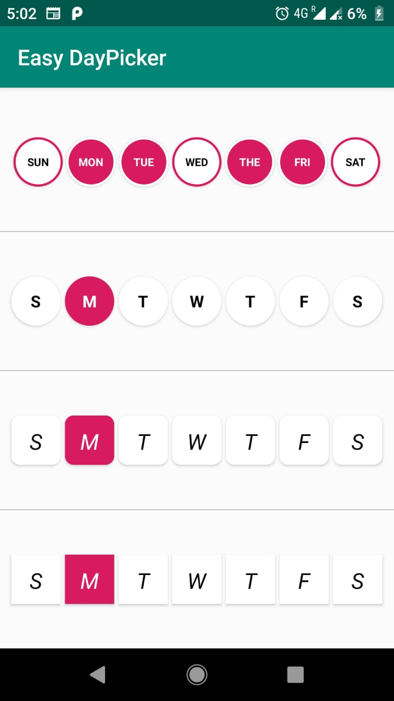

# EasyDayPicker-android

EasyDayPicker :- A android library helps you to select one or more weekday(s). 

[](https://jitpack.io/#hvyas3662/EasyDayPicker-android)




## How to use

 For a working implementation, please have a look at the app directory
 1. Add maven in your root build.gradle at the end of repositories
 2. Add the dependency
```gradle
allprojects {
  repositories {
    maven { url 'https://jitpack.io' }
  }
}

dependencies {
  implementation 'com.github.hvyas3662:EasyDayPicker-android:1.0'
}
```

## How do I use EasyDayPicker?

 1. add DayPicker view in yout xml file  
 
 ```xml
    <com.hvyas.easydaypicker.DayPicker
        android:layout_width="match_parent"
        android:layout_height="70dp"
        android:layout_weight="1"
        app:DayBtnBackground="@drawable/daybtnbackground_round"
        app:DayBtnMargin="2dp"
        app:DayBtnSelectedTextColor="@android:color/white"
        app:DayBtnTextAppearance="@style/easyDayPickerDefaultBtnStyle"
        app:DayBtnTextSize="5sp"
        app:DayBtnUnSelectedTextColor="@android:color/black"
        app:SelectedDay="monday" />
 ```
 
 2. java code
 
  ```java
       DayPicker dp = findViewById(R.id.dp);
       dp.setDaysName(new String[]{"Sun", "Mon", "Tue", "Wed", "The", "Fri", "Sat"});
       dp.setDayBtnTextSize(10);
       dp.setDayBtnMarginPx(5, 5, 5, 5);
       dp.setDayBtnStateTextColors(Color.parseColor("#000000"), Color.parseColor("#ffffff"));
       dp.setSelectedDayIndex(1);
       dp.setDayBtnTextAppearance(this, R.style.easyDayPickerDefaultBtnStyle);
       dp.setDayBtnBackground(R.drawable.daybtnbackground_ring);
       dp.setMultipleSelected(true, false, false, true, false, false, true);

       dp.setOnDaySelectionChangeListener(new OnDaySelectionChangeListener() {
           @Override
           public void OnDaySelectionChange(ArrayList<Boolean> getSelectedDays, ArrayList<String> getSelectedDaysName, ArrayList<String> getSelectedDaysShortName) {
               Log.d("SelectedDays Array list", getSelectedDays.toString());
               Log.d("SelectedDays Name", getSelectedDaysName.toString());
               Log.d("SelectedDays Short Name", getSelectedDaysShortName.toString());
           }
       });

      Log.d("SelectedDays Array list", dp.getSelectedDays().toString());
      Log.d("Selected Days Name", dp.getSelectedDaysName().toString());
      Log.d("SelectedDays Short Name", dp.getSelectedDaysShortName().toString());
      Log.d("Nth child of view", dp.getNthChild(1).toString());

  ```
  
## Customization

   1. xml attribute
   
   | Attribute | Description |
   | --- | --- |
   | `DayBtnMargin` | Set margin to day button |
   | `DayBtnMarginLeft` | Set left margin to day button |
   | `DayBtnMarginTop` | Set top margin to day button |
   | `DayBtnMarginBottom` | Set bottom margin to day button |
   | `DayBtnMarginRight` | Set right margin to day button |
   | `DayBtnBackground` | Set background to each day button, EasyDayPicker provide 4 type of background (daybtnbackground_ring, daybtnbackground_round, daybtnbackground_round_corner_square, daybtnbackground_square) |
   | `DayBtnTextAppearance` | Set textAppearance to each day button, EasyDayPicker provide 2 type of textAppearance(easyDayPickerDefaultBtnStyle, easyDayPickerDefaultBtnStyle_italic) |
   | `DayBtnSelectedTextColor` | Set selected state color of day button |
   | `DayBtnUnSelectedTextColor` | Set unselected state color of day button |
   | `DayBtnTextSize` | Set day button text size |
   | `SelectedDay` | Set selected given day value (none, sunday, monday, tuesday, wednesday, thursday, friday, saturday) |
   
   2. colors (ovrride these color in your colors.xml fle to change given background's color scheme)
   
   | Colors | Description |
   | --- | --- |
   | `day_btn_state_checked_bgcolor` | Day button selected state color |
   | `day_btn_state_unchecked_bgcolor` | Day button unselected state color |
   | `day_btn_state_checked_ringcolor` | Day button selected state border color |
   | `day_btn_state_checked_bgfill` | Day button selected state Fill color |
   | `day_btn_state_unchecked_ringcolor` | Day button unselected state border color |
   | `day_btn_state_unchecked_bgfill` | Day button unselected state Fill color | 

## Compatibility
  
  * Requires minimum android API 21 or above
